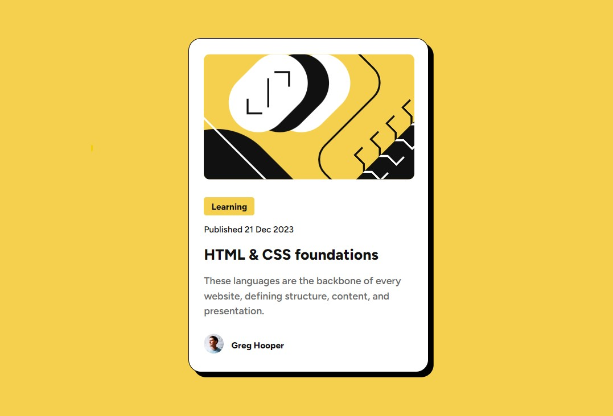

# Frontend Mentor - Blog preview card solution

## Table of contents

- [Overview](#overview)
  - [The challenge](#the-challenge)
  - [Screenshot](#screenshot)
  - [Links](#links)
- [My process](#my-process)
  - [Built with](#built-with)

### The Challenge

Users should be able to:

- See hover and focus states for all interactive elements on the page

### Screenshot

### Links

- Solution URL: [GitHub](https://github.com/wecax/frontendmentor-solutions/tree/main/blog-preview-card)
- Live Site URL: [Github Page](https://wecax.github.io/blog-preview-card/)

## My process

### Built with

- Flexbox
- CSS Grid

